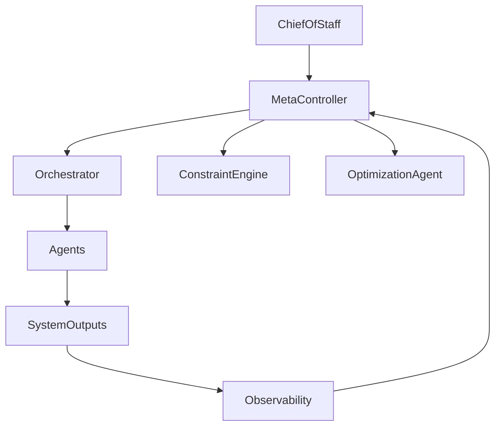

# 🧠 Harness Engineering Multi-Agent System

## Overview

This repository implements a **complete Harness Engineering multi-agent architecture**, inspired by:

- OpenAI — Harness Engineering  
- Anthropic — Long-Running Agent Systems  
- Martin Fowler — Harness Engineering  

The system is designed to build **reliable, observable, and controllable AI systems** through structured orchestration of specialized agents.

---

## 🏗️ What is a Harness?

A **Harness** is:

- The **environment** around an AI agent
- The **control system** that ensures reliability
- The **scaffolding** for long-running tasks

It includes:

- Constraints (rules, boundaries)
- Feedback loops (evaluation, retries)
- Tooling (CI, linters, runtime)
- State management (memory, artifacts)
- Verification systems (tests, external validation)

> "A harness is the combination of tooling, documentation, architectural constraints, and feedback loops that surround an agent."

---

## ⚠️ Problem Harness Engineering Solves

### Failure Modes of Raw Agents

- Context loss over time  
- Self-evaluation bias  
- Task drift  
- Accumulated entropy ("AI slop")  
- Non-deterministic outputs  

> "An agent that goes off the rails… isn’t a model problem. It’s an infrastructure problem."

---

## 🏗️ System Architecture

This architecture follows a **layered governance model**:

```text

Planning → Execution → Validation → Recovery → Optimization → Governance

```

Each layer is implemented through specialized agents working together under strict constraints and orchestration.

---

## 🧭 Governance Architecture

[Github Harness Engineering Multi-Agent System](https://github.com/charl-dev/harness-eng-multi-agent)

### 1. 🧩 Planning Layer

Responsible for transforming goals into executable structures.

- **Planner Agent**  
  → `agents/planner.md`  
  Breaks down goals into atomic tasks and DAGs

- **Knowledge / Context Curator**  
  → `agents/context-curator.md`  
  Filters and prepares relevant context for execution

---

### 2. ⚙️ Execution Layer

Responsible for performing tasks in a controlled environment.

- **Orchestrator Agent**  
  → `agents/orchestrator.md`  
  Executes pipelines and manages agent flow

- **Generator Agent**  
  → `agents/generator.md`  
  Produces artifacts (code, outputs)

- **Tooling / Integration Agent**  
  → `agents/integration.md`  
  Interfaces with APIs, databases, external tools

- **Environment / Sandbox Agent**  
  → `agents/sandbox.md`  
  Executes code in isolated environments

---

### 3. ✅ Validation Layer

Ensures correctness, quality, and alignment.

- **Evaluator Agent**  
  → `agents/evaluator.md`  
  Validates outputs against requirements

- **Alignment / Guardrail Agent**  
  → `agents/guardrail.md`  
  Ensures intent fidelity and safety

- **Constraint / Policy Engine**  
  → `agents/policy.md`  
  Enforces global system rules

- **Simulation / Dry-Run Agent**  
  → `agents/dry-run.md`  
  Validates plans before execution

---

### 4. ♻️ Recovery Layer

Handles failures and maintains system continuity.

- **Recovery / Self-Healing Agent**  
  → `agents/self-healing.md`  
  Applies retries, rollback, and corrective actions

- **Audit / Observability Agent**  
  → `agents/observability.md`  
  Monitors system behavior and provides insights

---

### 5. 💰 Optimization Layer

Improves efficiency and system performance.

- **Cost / Resource Optimization Agent**  
  → `agents/resource-optimization.md`  
  Optimizes tokens, compute, and execution time

- **State Manager Agent**  
  → `agents/state-manager.md`  
  Persistence and Context Rehydration

---

### 6. 🧠 Governance Layer

Ensures system-wide coherence and strategic alignment.

- **Chief of Staff**  
  → `agents/chief-of-staff.md`  
  Defines global strategy and context

- **Harness Architect**  
  → `agents/harness-architect.md`  
  Designs system structure and pipelines

- **Meta-Controller / System Governor**  
  → `agents/system-governor.md`  
  Oversees all agents and ensures global coherence

---

## 🔄 Execution Flow



---

## 🧠 Core Principles

### 1. Deterministic Execution

- Tasks are atomic and verifiable
- Execution is reproducible

### 2. Strict Separation of Concerns

- Each agent has a single responsibility
- No overlapping roles

### 3. Observable Systems

- Full traceability of actions
- Structured logs and metrics

### 4. Constraint-Driven Design

- Rules are enforced programmatically
- No reliance on implicit behavior

### 5. Feedback Loops Everywhere

- Evaluation → Recovery → Optimization → Governance

---

## 📂 Repository Structure

```text

/agents
/instructions

```

---

## 🧪 Example Execution Plan

```yaml
goal: "Build a REST API"

tasks:
  - id: design_api
    agent: planner
  - id: generate_code
    agent: generator
    depends_on: design_api
  - id: validate_code
    agent: evaluator
    depends_on: generate_code
```

---

## 🚨 Failure Handling

Failures are handled through:

- Retry strategies
- Rollbacks (state checkpoints)
- Context rehydration
- Strategy adaptation

---

## 📊 Observability

Every step produces:

- Execution traces
- Metrics (latency, cost, success rate)
- Logs (structured)

---

## 🔐 Safety & Constraints

- Global policies enforced by Constraint Engine
- Alignment checks for intent fidelity
- Sandbox execution for code safety

---

## ⚡ Key Benefits

- High reliability
- Full transparency
- Scalable architecture
- Safe execution
- Continuous optimization

---

## 🧠 Final Insight

This architecture represents a **complete Harness Engineering system**, where:

- Planning ensures clarity
- Execution ensures action
- Validation ensures correctness
- Recovery ensures resilience
- Optimization ensures efficiency
- Governance ensures coherence

---

## 📚 Sources

- [OpenAI Harness Engineering](https://openai.com/index/harness-engineering/?utm_source=chatgpt.com)
- [Anthropic Harness Design (Long-running apps)](https://azrod.me/en/articles/ai-agent-harness?utm_source=chatgpt.com)
- [Martin Fowler Harness Engineering](https://martinfowler.com/articles/exploring-gen-ai/harness-engineering.html?utm_source=chatgpt.com)
- [Agent Engineering](https://www.agent-engineering.dev/article/harness-engineering-in-2026-the-discipline-that-makes-ai-agents-production-ready?utm_source=chatgpt.com)

---

## 🚀 Next Steps

- Implement agent runtime interfaces
- Add real tool integrations
- Build observability dashboards
- Introduce human-in-the-loop governance

---

**This system is not just multi-agent — it is fully governed, observable, and production-ready by design.**
