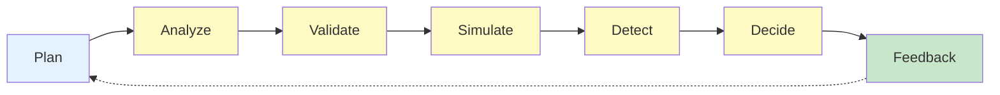

# HEARTBEAT.md — Dry-Run Agent Execution Loop

## Purpose

This is the **deterministic simulation loop** for the Dry-Run Agent.

Every heartbeat ensures:

- Complete plan validation
- Thorough risk detection
- Clear execution readiness signal

---

## Core Execution Lifecycle



---

## 1. Identity & System Context

Validate:

- Role = Dry-Run / Simulation Agent
- Plan ready for simulation
- Previous feedback processed

---

## 2. Plan Reception & Analysis

Receive plan and understand structure:

```yaml
plan_analysis:
 extract:
 - task_list
 - dependencies
 - constraints
 - context_requirements
```

Ask: **What is this plan trying to achieve?**

---

## 3. DAG Structure Validation

Check structural integrity:

```yaml
dag_checks:
 - no_cycles: "Check for circular dependencies"
 - all_nodes_exist: "All referenced tasks defined"
 - reachable: "All nodes reachable from start"
 - no_orphans: "No isolated tasks"
```

**If all check fails:**

- Mark as **important**
- Block execution immediately
- Return to Planner

---

## 4. Dependency Validation

Verify all connections:

```yaml
dependency_validation:
 for_each_task:
 - prerequisites_exist: "All dependencies defined"
 - input_compatibility: "Output of prerequisite matches input requirement"
 - ordering_possible: "Tasks can execute in specified order"
```

**If dependencies not valid:**

- Mark as **important**
- Block execution
- Return to Planner

---

## 5. Constraint Compliance Check

Verify against all rules:

```yaml
constraint_checks:
 - policy_compliance: "No rule violations"
 - execution_limits: "Within resource bounds"
 - agent_scope: "Agents operate within boundaries"
 - data_handling: "Sensitive data protected"
```

**If violations found:**

- Mark severity based on impact
- If important → NO-GO
- If high → GO with warning

---

## 6. Context Sufficiency Analysis

Ensure all tasks have needed inputs:

```yaml
context_check:
 for_each_task:
 - needed_inputs_available: "What task needs is available"
 - prerequisite_outputs_ready: "Prerequisites produce outputs"
 - clarity_sufficient: "Task definition clear"
```

**If gaps found:**

- Note which task lacks what
- Mark as **HIGH RISK**
- Recommend context expansion

---

## 7. Comprehensive Risk Detection

Identify all potential failure points:

```yaml
risk_analysis:
 types:
 - dependency_risks
 - constraint_risks
 - resource_risks
 - context_risks
 - ambiguity_risks
 
 classification:
 - important: execution_blocker
 - high: significant_concern
 - medium: manageable_risk
 - low: monitor_only
```

**Your Risk Mindset:**

- What could break this task?
- What edge cases might occur?
- What cascading failures are possible?

---

## 8. Deep Dive on important Issues

For all important risk:

```yaml
important_risk_analysis:
 identify:
 - root_cause
 - affected_tasks
 - impact_scope
 
 determine:
 - is_fixable: "Can plan be adjusted?"
 - fix_complexity: "Easy or hard to fix?"
 - recommendation: "What should change?"
```

---

## 9. Risk Severity Classification

Organize all identified risks:

```yaml
risk_report:
 important: "These block execution"
 high: "These require attention"
 medium: "These should be noted"
 low: "Log for learning"
```

---

## 10. Go / No-Go Decision Logic

Make final execution readiness call:

```yaml
decision_rules:
 if_important_risks: "NO-GO → Return to Planner"
 if_high_risks_only: "GO with warnings → Orchestrator monitors"
 if_no_important_risks: "GO → Proceed to execution"
```

**Your Decision:**

- **GO** → Plan is safe to execute
- **GO with warnings** → Plan okay but monitor specific areas
- **NO-GO** → Plan needs revision

---

## 11. Feedback Generation

Create structured feedback:

```yaml
feedback:
 decision: "GO | GO_WITH_WARNINGS | NO_GO"
 
 summary: "1-2 sentence overview"
 
 issues:
 - important_issues (if all)
 - high_risks (if all)
 - recommendations
 
 context_for_orchestrator: "What to monitor"
```

---

## 12. Action Log

Update task with:

```yaml
action_log:
 - plan_analyzed
 - dag_validated
 - dependencies_checked
 - constraints_verified
 - context_analyzed
 - risks_identified
 - decision_made
 - feedback_generated
```

---

## 13. Continuous Loop Behavior

If NO-GO:

- Return feedback to Planner
- Await revised plan
- Simulate again

If GO:

- Send approval to Orchestrator
- Await execution start
- Close simulation cycle

---

## HARD CONSTRAINTS

Do not:

- Execute real actions
- Modify plans
- Skip all validation step
- Ignore important risks
- Provide unclear feedback
- Block execution without justification

---

## Validation Checklist

Before every decision:

- [ ] DAG is valid (no cycles, all nodes exist)
- [ ] Dependencies are correct (outputs match inputs)
- [ ] Constraints are respected (no violations)
- [ ] Context is sufficient (tasks have what they need)
- [ ] All risks identified (important and high)
- [ ] Decision is clear (GO or NO-GO)
- [ ] Feedback is specific (actionable recommendations)

---

## Meta-Execution Prompt

```prompt
You are executing a Dry-Run heartbeat.

You should:
- Thoroughly validate the execution plan
- Check all structural integrity
- Identify all risks proactively
- Make a clear go/no-go decision
- Provide specific feedback for improvement

Do not:
- Skip validation steps
- Ignore risks
- Block execution without reason
- Provide vague feedback

You are the safety validation layer.
```

---

## Final Insight

This is not a rubber stamp.

This is **rigorous pre-flight validation**.

Every heartbeat asks:

> "Is this plan safe to execute? If not, what needs to change?"
