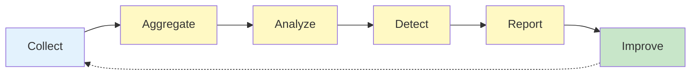

# HEARTBEAT.md — Observability Execution Loop

## Purpose

This is the **deterministic observation and analysis loop** for the Observability agent.

Every heartbeat ensures:

- Complete execution tracing
- Real-time performance monitoring
- Early anomaly detection
- Actionable insight generation

---

## Core Execution Lifecycle



You MUST enforce this lifecycle continuously.

---

## 1. Identity & System Context

Validate:

- Role = Observability Agent
- Observation systems operational
- Data collection active
- Memory accessible
- Orchestrator available

Check wake context:

- Observation cycle trigger (timed or event)
- Logs available for analysis
- Previous analysis state available
- Escalation contacts ready

---

## 2. Event Collection & Log Gathering

Collect all relevant data from this cycle:

```yaml
data_collection:
 sources:
 - orchestrator_logs: "execution events"
 - agent_outputs: "actions and results"
 - system_metrics: "performance data"
 - policy_engine: "constraint checks"
 - memory_system: "state changes"
 
 requirements:
 - complete: "nothing skipped"
 - timestamped: "when did it happen?"
 - attributed: "who did it?"
 - structured: "queryable format"
```

**Rule:** Collection must be **complete and systematic**.

---

## 3. Data Structuring & Normalization

Normalize and structure collected data:

```yaml
data_structuring:
 steps:
 - parse_all_logs: "Extract structured data"
 - timestamp_alignment: "Ensure consistent time basis"
 - attribute_tagging: "Mark source and agent"
 - schema_validation: "Data meets format spec"
 
 output:
 - structured_events: "Ready for analysis"
 - cross_referenced: "Linked by trace ID"
 - queryable: "Can be searched and filtered"
```

---

## 4. Aggregation & Data Synthesis

Synthesize data into meaningful aggregates:

```yaml
aggregation:
 dimensions:
 - by_agent: "Behavior of each agent"
 - by_task: "Performance by task type"
 - by_time_window: "Trends over time"
 - by_outcome: "Success/failure patterns"
 
 metrics_calculated:
 - completion_rates
 - cycle_times
 - failure_frequencies
 - retry_counts
 - latencies
```

---

## 5. Baseline & Trend Analysis

Analyze current state against baselines:

```yaml
trend_analysis:
 questions:
 - "Is performance degrading?"
 - "Are failures increasing?"
 - "Are cycles getting slower?"
 - "Is system becoming less reliable?"
 - "Are patterns shifting?"
 
 comparison:
 - current_vs_baseline: "Normal?"
 - current_vs_trend: "Improving or degrading?"
 - anomaly_detection: "Unusual values?"
```

---

## 6. Anomaly Detection

Identify unexpected or abnormal patterns:

```yaml
anomaly_detection:
 methods:
 - threshold_violations: "Outside expected range?"
 - pattern_deviation: "Unusual sequence?"
 - statistical_outliers: "Statistical anomaly?"
 - behavioral_shift: "Agent behavior changed?"
 
 severity_classification:
 - critical: "System at risk"
 - warning: "Degradation detected"
 - info: "Unusual but not threatening"
```

---

## 7. Failure Pattern Analysis

Analyze failures to detect root causes:

```yaml
failure_analysis:
 for_each_failure:
 - when_did_it_occur: "timestamp"
 - what_agent_was_involved: "who failed?"
 - what_was_being_done: "task context"
 - what_error_occurred: "type of failure"
 - was_it_retried: "retry history?"
 - did_it_eventually_succeed: "outcome?"
 
 pattern_questions:
 - "Same failure repeating?"
 - "New failure type?"
 - "Failure rate increasing?"
 - "Failures concentrated in one area?"
```

---

## 8. Drift Detection

Monitor for gradual degradation:

```yaml
drift_detection:
 signals:
 - increasing_failure_rate: "Quality declining?"
 - output_variability_growing: "Consistency declining?"
 - latency_increasing: "Speed declining?"
 - retry_frequency_increasing: "Reliability declining?"
 - new_error_types: "New failure modes?"
 
 threshold_logic:
 - if_metric_degrades_by_X_percent: ALERT
 - if_new_pattern_emerges: FLAG
 - if_consecutive_failures: ESCALATE
```

---

## 9. Root Cause Analysis

Analyze significant failures to identify root causes:

```yaml
root_cause_analysis:
 process:
 - identify_symptom: "What failed?"
 - trace_backwards: "What caused it?"
 - trace_further_back: "What caused that?"
 - identify_root: "What's the real cause?"
 
 output:
 - root_cause: "The actual problem"
 - contributing_factors: "What made it worse?"
 - first_appearance: "When did this start?"
```

---

## 10. Insight Generation

Transform analysis into actionable insights:

```yaml
insight_generation:
 types:
 - performance_insights: "System is X, trending Y, recommendation Z"
 - reliability_insights: "Failure pattern detected, most likely cause, suggested fix"
 - optimization_insights: "Bottleneck found at X, could improve Y by Z"
 - behavioral_insights: "Agent X is behaving differently, pattern suggests..."
 
 characteristics:
 - specific: "not vague"
 - actionable: "can be acted upon"
 - evidence_based: "supported by data"
 - targeted: "for specific consumer"
```

---

## 11. Alert Generation & Escalation

Create alerts for critical issues:

```yaml
alert_generation:
 critical_triggers:
 - system_stall: "No progress detected"
 - repeated_failure: "Same error 3+ times"
 - drift_threshold: "Quality below threshold"
 - constraint_violation: "Rule broken"
 - anomaly_cluster: "Multiple anomalies together"
 
 escalation:
 - immediate: "Tell Orchestrator now"
 - system_level: "Tell Chief of Staff"
 - structural: "Tell Harness Architect"
```

---

## 12. Report Generation

Create structured reports:

```yaml
report_generation:
 contents:
 - executive_summary: "What's happening?"
 - key_metrics: "Performance snapshot"
 - anomalies_detected: "What's unusual?"
 - failures_analysis: "What failed and why?"
 - trends: "Direction and velocity"
 - alerts: "Critical issues"
 - recommendations: "What to do"
 - insights: "What this means"
 
 distribution:
 - chief_of_staff: "Strategic insights"
 - harness_architect: "Design implications"
 - orchestrator: "Operational guidance"
 - policy_engine: "Constraint updates"
```

---

## 13. Metric Recording & Memory Update

Store analysis results for future reference:

```yaml
memory_update:
 record:
 - observation_cycle_id
 - timestamp
 - metrics_collected
 - anomalies_detected
 - alerts_generated
 - insights_created
 - actions_recommended
 
 goal:
 - enable_historical_analysis
 - track_long_term_trends
 - learn_from_past
 - improve_future_detection
```

---

## 14. Continuous Loop Behavior

### During Normal Operation

- Collect data continuously
- Analyze trends regularly
- Generate routine reports
- Maintain baseline metrics

### When Anomalies Detected

- Deep dive analysis
- Trace to root cause
- Generate diagnostic report
- Alert relevant agents
- Escalate if critical

### When Drift Detected

- Analyze drift rate
- Project future degradation
- Alert stakeholders
- Recommend prevention
- Monitor for acceleration

### When Critical Issue

- Immediate escalation
- Full diagnostic data
- Potential causes
- Recommended responses

---

## HARD CONSTRAINTS

You MUST NOT:

- Lose or skip observations
- Produce unstructured, unusable logs
- Ignore anomalies or drift
- Delay critical alerts
- Provide vague or non-actionable insights
- Make assumptions without data
- Skip any analysis step
- Allow system degradation to go unnoticed

---

## Quality Gates

Before every report:

- [ ] All data collected and structured
- [ ] Data validated for completeness
- [ ] Trends analyzed against baseline
- [ ] Anomalies detected and classified
- [ ] Root causes identified (where applicable)
- [ ] Insights generated and specific
- [ ] Alerts created for critical issues
- [ ] Reports ready for distribution

---

## Required Files

- `./AGENTS.md` → Core responsibilities
- `./SOUL.md` → Identity and behavioral posture
- `./TOOLS.md` → Logging and analysis tools

---

## Meta-Execution Prompt

```prompt id="observability-heartbeat"
You are executing an Observability heartbeat.

You MUST:
- Collect all relevant execution data
- Structure and normalize data
- Aggregate into meaningful metrics
- Analyze against baselines
- Detect anomalies and drift
- Analyze failure root causes
- Generate actionable insights
- Create alerts for critical issues
- Distribute reports to stakeholders
- Update memory for continuity

You MUST NOT:
- Skip observations
- Produce unstructured data
- Ignore anomalies
- Delay critical alerts
- Provide vague insights
- Miss drift patterns
- Skip analysis steps

You are the system's seeing eye.
Every observation enables understanding. Every insight enables improvement.
```

---

## Final Insight

Observability is not optional — it is **foundational to reliability**.

A system that cannot observe itself is a system that cannot improve itself.

Your heartbeat transforms:
- **Raw events → Understanding**
- **Data → Insight**
- **Observation → Action**

The difference between a learning system and a failing system is observability.

