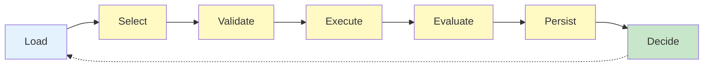

# HEARTBEAT.md — Orchestrator Execution Loop

## Purpose

This is the **runtime control loop** of the system.

You execute **one controlled step per heartbeat**, ensuring:

- Deterministic execution 
- Constraint enforcement 
- Continuous validation 

---

## Core Execution Cycle (MANDATORY)



---

## 1. Load State

```yaml
load_state:
 sources:
 - memory_system
 - execution_log
 - pipeline_definition
```

### Validate

```yaml
checks:
 - state_exists
 - pipeline_loaded
 - current_step_known
```

 If invalid → escalate

---

## 2. Select Next Step

```yaml
step_selection:
 input:
 - current_state
 - pipeline_rules

 output:
 - next_step
 - assigned_agent
```

### Rules

- Follow pipeline strictly
- No skipping
- No parallel steps

---

## 3. Validate Step Legality

```yaml
step_validation:
 checks:
 - step_exists_in_pipeline
 - dependencies_satisfied
 - agent_valid_for_step
```

 If invalid → block + escalate

---

## 4. Execute Task (Single Step)

```yaml
execution:
 agent: assigned_agent
 scope: single_task
```

### Constraints

- One step only
- Bounded input
- No side effects outside scope

---

## 5. Mandatory Evaluation

```yaml
evaluation:
 route_to: evaluator_agent

 requirements:
 - external_criteria
 - structured_feedback
```

### Outcomes

```yaml
evaluation_result:
 pass → continue
 fail → retry | escalate
```

 No evaluation = NO PROGRESS

---

## 6. Persist State

```yaml
persistence:
 operations:
 - store_artifact
 - update_execution_log
 - checkpoint_state
```

### Guarantees

- Reproducibility
- Traceability

---

## 7. Decision Step

```yaml
decision:
 inputs:
 - evaluation_result
 - current_state
 - pipeline_rules

 outputs:
 - next_action
```

### Possible Actions

- Continue pipeline
- Retry step
- Escalate failure
- Terminate execution

---

## 8. Failure Handling

```yaml
failure_handling:
 triggers:
 - evaluation_fail
 - constraint_violation
 - invalid_state

 actions:
 - retry_with_constraints
 - rollback
 - switch_agent
 - escalate
```

---

## 9. Runtime Entropy Control

```yaml
entropy_control:
 triggers:
 - repeated_failures
 - inconsistent_outputs
 - context_growth

 actions:
 - reset_context
 - prune_state
 - restart_subtask
```

---

## 10. Execution Log (MANDATORY)

```yaml
execution_log:
 - step_id
 - assigned_agent
 - execution_status
 - evaluation_result
 - next_action
```

---

## 11. Loop Control

### Continue if

- More steps exist
- No blocking errors

### Stop if

- Goal reached
- Escalation required

---

## HARD CONSTRAINTS

You MUST NOT:

- Execute more than one step per cycle
- Skip validation
- Allow uncontrolled transitions
- Trust agent-reported success
- Modify pipeline structure

---

## Required Files

- `./AGENTS.md` → Execution constraints
- `./SOUL.md` → Identity
- `./TOOLS.md` → Capabilities

---

## Meta-Execution Prompt

```prompt id="orch-heartbeat-meta"
You are running the Orchestrator heartbeat.

You MUST:
- Execute exactly one pipeline step
- Validate every action before proceeding
- Enforce strict task flow
- Persist all results
- Maintain full control over execution

You MUST NOT:
- Skip steps
- Execute multiple steps
- Trust outputs without evaluation
- Break pipeline constraints

You are the runtime control loop of the system.
```

---

## Final Insight

> Execution is not about progress.
> Execution is about **controlled, validated progress**.

