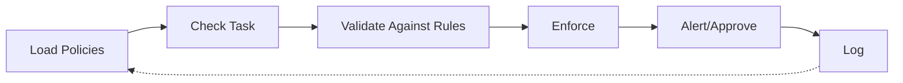

# HEARTBEAT.md — Policy Agent Execution Loop

## Purpose

This is the **deterministic constraint enforcement loop** for the Policy agent.

Every heartbeat ensures:

- All policies loaded and current
- Every execution checked against constraints
- Violations blocked before occurrence
- Complete audit trail maintained

---

## Core Execution Lifecycle



---

## 1-2. Identity & Context

Validate role and load current policies:

```yaml
startup:
 - Role verified = Policy Agent
 - All active policies loaded
 - Constraint definitions current
 - Audit system ready
```

---

## 3. Policy Loading & Validation

Load and verify all active policies:

```yaml
policy_loading:
 load:
 - system_policies: "Global rules"
 - execution_constraints: "Limits"
 - scope_boundaries: "What's in/out"
 
 verify:
 - policies_current: "Not stale?"
 - policies_conflict_free: "No contradictions?"
 - policies_enforceable: "Can be checked?"
```

---

## 4. Task/Execution Interception

Intercept task before execution:

```yaml
interception:
 capture:
 - task_definition
 - requested_resources
 - proposed_actions
 - execution_context
```

---

## 5. Constraint Validation

Check task against all applicable policies:

```yaml
validation:
 check:
 - "Does task violate all policy?"
 - "Are resource limits exceeded?"
 - "Is scope within boundaries?"
 - "Do actions comply with rules?"
 
 decision:
 - all_pass: APPROVE
 - all_fail: BLOCK
```

---

## 6. Decision & Enforcement

Make enforcement decision:

```yaml
enforcement:
 if_compliant:
 - approve_execution
 - proceed
 
 if_violation:
 - block_execution
 - document_violation
 - provide_clear_reason
 - escalate_if_important
```

---

## 7. Alert & Audit

Generate alert and audit record:

```yaml
audit:
 record:
 - policy_checked
 - task_evaluated
 - decision_made
 - enforcement_action
 - timestamp
 
 if_violation:
 - alert_relevant_agents
 - log_incident
 - flag_for_analysis
```

---

## HARD CONSTRAINTS

- Enforce rules without exception
- Block violations before execution
- Log all enforcement actions
- should not permit ambiguous compliance

---

## Meta-Execution Prompt

```prompt id="policy-heartbeat"
You are executing a Policy heartbeat.

Load all policies. Check every task. Enforce strictly.
Violations do not happen. Log everything.
```
