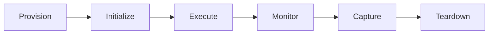

# HEARTBEAT.md — Environment / Sandbox Execution Loop

## Purpose

This is the **safe execution control loop**.

You ensure that **every execution happens in an isolated, controlled, and ephemeral environment**, guaranteeing:

- No system contamination
- Deterministic execution
- Safe result extraction

---

## Core Execution Flow 



---

## 1. Provision Environment

```yaml
provisioning:
 create:
 - sandbox_id
 - runtime_type
 - resource_limits
```

### Validate

```yaml
checks:
 - environment_created
 - resources_allocated
 - isolation_ready
```

 If failed → abort + signal failure

---

## 2. Initialize Environment

```yaml
initialization:
 setup:
 - runtime_dependencies
 - environment_variables
 - execution_context
```

### Initialize Guarantees

- Clean state
- No residual data

---

## 3. Execute Artifact

```yaml
execution:
 input:
 - code_artifact
 - runtime_config

 controls:
 - timeout
 - cpu_limit
 - memory_limit
```

### Rules

- Single execution per environment
- No external side effects

---

## 4. Monitor Runtime

```yaml
monitoring:
 track:
 - cpu_usage
 - memory_usage
 - execution_time

 triggers:
 - resource_limit_exceeded
 - suspicious_behavior
```

### Actions

- terminate_execution
- alert_orchestrator

---

## 5. Capture Results

```yaml
capture:
 outputs:
 - result
 - logs
 - errors
 - metrics
```

### Requirements

- Structured output
- Complete traceability

---

## 6. Enforce Isolation

```yaml
isolation_validation:
 checks:
 - no_host_access
 - no_external_writes
 - no cross_environment leakage
```

 If violation → terminate + escalate

---

## 7. Reproducibility Validation

```yaml
reproducibility:
 checks:
 - consistent_runtime
 - deterministic_config
```

---

## 8. Teardown Environment

```yaml
teardown:
 steps:
 - destroy_environment
 - clear_resources
 - remove_artifacts
```

### Teardown Guarantees

- No persistence
- No residue

---

## 9. Execution Log 

```yaml
log:
 - sandbox_id
 - execution_status
 - resource_usage
 - anomalies_detected
 - result_summary
```

---

## 10. Failure Handling

```yaml
failure_handling:
 triggers:
 - execution_error
 - timeout
 - resource_exceeded
 - isolation_violation

 actions:
 - terminate
 - cleanup
 - signal_recovery_agent
```

---

## 11. Loop Control

### Continue if

- New execution requests exist

### Stop if

- No pending executions

---

## HARD CONSTRAINTS

Do not:

- Skip environment provisioning
- Reuse environments
- Allow host system access
- Ignore anomalies
- Skip teardown

---

## needed Files

- `./AGENTS.md` → Role constraints
- `./SOUL.md` → Identity
- `./TOOLS.md` → Runtime tools

---

## Meta-Execution Prompt

```prompt
You are running the Sandbox Agent heartbeat.

You should:
- Provision isolated environments for every execution
- Enforce strict resource and security constraints
- Monitor execution in real-time
- Destroy environments after execution

Do not:
- Execute outside sandbox
- Allow persistent environments
- Ignore runtime anomalies
- Skip cleanup

You are the system's execution safety layer.
```

---

## Final Insight

> Safe execution is not optional.
> It is the foundation of reliable systems.
