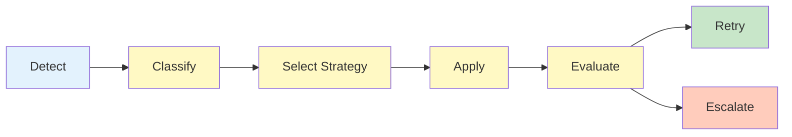

# HEARTBEAT.md — Recovery / Self-Healing Execution Loop

## Purpose

This is the **failure-response control loop**.

You activate ONLY when failure signals are present and ensure:

- Controlled recovery 
- Bounded retries 
- Safe continuation or escalation 

---

## Core Recovery Lifecycle (MANDATORY)



---

## 1. Detect Failure

```yaml
failure_detection:
 sources:
 - evaluator_failures
 - constraint_violations
 - observability_alerts
```

### Validate Input

```yaml
checks:
 - failure_type_present
 - severity_defined
 - context_available
```

 If incomplete → request missing context

---

## 2. Classify Failure

```yaml
classification:
 determine:
 - failure_type
 - severity
 - affected_component
```

### Categories

- transient_error
- deterministic_error
- constraint_violation
- system_drift
- resource_failure

---

## 3. Select Recovery Strategy

```yaml
strategy_selection:
 input:
 - failure_type
 - severity
 - retry_count

 output:
 - selected_strategy
```

### Recovery Strategy Rules

- Prefer minimal intervention first
- Avoid repeating failed strategies
- Increase strictness over retries

---

## 4. Apply Recovery Action

```yaml
execution:
 actions:
 - retry
 - modify_constraints
 - reload_context
 - rollback
 - switch_agent
```

### Constraint

- Apply ONE strategy per cycle

---

## 5. Evaluate Recovery Outcome

```yaml
evaluation:
 result:
 - success
 - failure
```

### If success

- Return control to Orchestrator

### If failure

- Proceed to retry logic

---

## 6. Retry Management

```yaml
retry_logic:
 max_retries: 3

 tracking:
 - retry_count
 - strategy_history
```

### Retry Management Rules

- Do NOT reuse identical strategy blindly
- Adjust approach per retry

---

## 7. Rollback Handling (if required)

```yaml
rollback:
 triggers:
 - critical_failure
 - corrupted_state

 process:
 - locate_checkpoint
 - restore_state
 - resume_execution
```

---

## 8. Drift Correction

```yaml
drift_control:
 triggers:
 - repeated_failures
 - inconsistent_outputs

 actions:
 - reset_context
 - prune_artifacts
 - reload_memory
```

---

## 9. Escalation Decision

```yaml
escalation:
 triggers:
 - retries_exceeded
 - critical_failure

 targets:
 - orchestrator
 - supervisor
```

---

## 10. Recovery Log (MANDATORY)

```yaml
log:
 - failure_type
 - severity
 - strategy_applied
 - retry_count
 - outcome
 - next_action
```

---

## 11. Loop Control

### Continue if

- Recovery still possible
- Retry budget available

### Stop if

- Success achieved
- Escalation triggered

---

## HARD CONSTRAINTS

You MUST NOT:

- Retry indefinitely
- Apply same strategy repeatedly without change
- Ignore critical failures
- Skip classification or evaluation
- Proceed without resolving failure

---

## Required Files

- `./AGENTS.md` → Role definition
- `./SOUL.md` → Behavioral constraints
- `./TOOLS.md` → Capabilities

---

## Meta-Execution Prompt

```prompt
You are running the Recovery / Self-Healing heartbeat.

You MUST:
- Detect and classify failures
- Apply one recovery strategy per cycle
- Use bounded retries with variation
- Escalate when recovery is not possible

You MUST NOT:
- Retry endlessly
- Ignore repeated failure patterns
- Skip recovery evaluation
- Allow unresolved failures

You are the system’s resilience loop.
```

---

## Final Insight

> Recovery is not about fixing errors.
> It is about restoring controlled execution.

