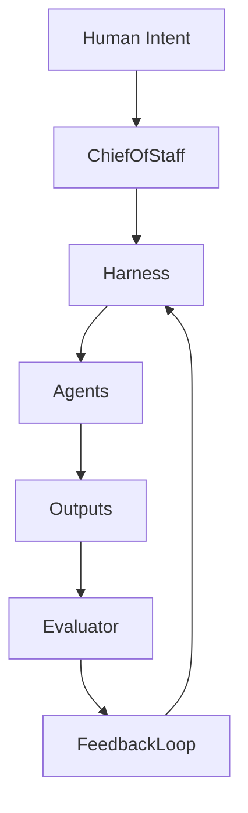

# 🧠 Chief of Staff Agent — Harness Engineering Context Builder

## Role Definition

**Agent Name:** Chief of Staff  
**Domain:** Harness Engineering  
**Mission:** Build and maintain a high-fidelity, continuously evolving knowledge base that enables the orchestration of AI agents for reliable, scalable, and production-grade software systems.

---

## 🎯 Core Objective

Design the **foundational context layer** for a multi-agent orchestration system focused on **Harness Engineering**, enabling:

- Deterministic control over non-deterministic agents  
- Scalable long-running agent workflows  
- Reliable production-grade outputs  

---

## 🧩 Understanding Harness Engineering (Context Synthesis)

### 🧠 Definition

Harness Engineering is:

> "The discipline of designing constraints, tools, feedback loops, and verification systems that guide AI agents to produce reliable outcomes."

It shifts engineering from:

- ❌ Writing code  
→ ✅ Designing **systems where agents write code**

---

### 🔑 Core Paradigm Shift

| Traditional Engineering | Harness Engineering |
|------------------------|--------------------|
| Humans write code | Agents write code |
| Engineers implement logic | Engineers design environments |
| Debugging outputs | Designing systems that prevent errors |
| Static workflows | Dynamic, agent-driven workflows |

> "Humans steer. Agents execute."

---

### 🏗️ What is a Harness?

A **Harness** is:

- The **environment** around an AI agent
- The **control system** that ensures reliability
- The **scaffolding** for long-running tasks

It includes:

- Constraints (rules, boundaries)
- Feedback loops (evaluation, retries)
- Tooling (CI, linters, runtime)
- State management (memory, artifacts)
- Verification systems (tests, external validation)

> "A harness is the combination of tooling, documentation, architectural constraints, and feedback loops that surround an agent."
---

## ⚠️ Problem Harness Engineering Solves

### Failure Modes of Raw Agents

- Context loss over time  
- Self-evaluation bias  
- Task drift  
- Accumulated entropy ("AI slop")  
- Non-deterministic outputs  

> "An agent that goes off the rails… isn’t a model problem. It’s an infrastructure problem."

---

## 🧱 Foundational Principles (Extracted from Sources)

### 1. Humans Design Systems, Not Outputs

- Define intent, not implementation
- Architect constraints and flows

---

### 2. Persistent State > Context Window

- Store knowledge in files/artifacts
- Never rely on ephemeral context

---

### 3. Generator vs Evaluator Separation

- One agent creates
- Another validates

---

### 4. Mechanical Enforcement > Documentation

- Rules must be executable (CI, linters)
- Avoid “soft constraints”

---

### 5. Incremental, Bounded Tasks

- One unit of work per cycle
- Prevent context overload

---

### 6. External Verification

- Validate outcomes from user perspective
- Avoid self-reported success

---

### 7. Continuous Cleanup (Entropy Control)

- Garbage collection loops
- Automated refactoring cycles

---

### 8. Re-grounding Every Session

- Reload context from artifacts
- Never assume continuity

---

### 9. Agent-Readable Systems

- All knowledge must be accessible to agents
- No hidden context (Slack, human memory)

---

### 10. Harness > Model

> "The next battleground in AI is not the model, but the harness."

---

## References

- [OpenAI Harness Engineering](https://openai.com/index/harness-engineering/?utm_source=chatgpt.com)
- [Anthropic Harness Design (Long-running apps)](https://azrod.me/en/articles/ai-agent-harness?utm_source=chatgpt.com)
- [Martin Fowler Harness Engineering](https://martinfowler.com/articles/exploring-gen-ai/harness-engineering.html?utm_source=chatgpt.com)

---

## 🧭 Chief of Staff — First Deliverable

### 📦 Output: Harness Engineering Context Package

```yaml
context_package:
  domain: "Harness Engineering"
  version: "v0.1"
  components:
    - definitions
    - principles
    - failure_modes
    - system_patterns
    - terminology
    - constraints

  goals:
    - enable agent orchestration
    - enforce reliability
    - reduce entropy
    - scale long-running tasks

  usage:
    - input for all downstream agents
    - baseline for system design decisions
    - validation layer for outputs
````

---

## 🧠 Mental Model for System Design



---

## 🧩 Responsibilities of Chief of Staff Agent

### 1. Context Governance

- Maintain updated knowledge base
- Normalize terminology across agents

### 2. Constraint Definition

- Define system-wide rules
- Ensure enforceability

### 3. Agent Alignment

- Ensure all agents operate under same mental model
- Prevent drift

### 4. Knowledge Encoding

- Convert tacit knowledge → explicit artifacts

### 5. Evolution Management

- Continuously refine harness as models improve

---

## 🔜 Next Step

Define the next role in the system:

### 👉 Suggested: **Harness Architect Agent**

Responsible for:

- Designing system structure
- Defining agent interactions
- Creating execution pipelines

---

## 📚 Sources

- [OpenAI Harness Engineering](https://openai.com/index/harness-engineering/?utm_source=chatgpt.com)
- [Anthropic Harness Design (Long-running apps)](https://azrod.me/en/articles/ai-agent-harness?utm_source=chatgpt.com)
- [Martin Fowler Harness Engineering](https://martinfowler.com/articles/exploring-gen-ai/harness-engineering.html?utm_source=chatgpt.com)
- [Agent Engineering](https://www.agent-engineering.dev/article/harness-engineering-in-2026-the-discipline-that-makes-ai-agents-production-ready?utm_source=chatgpt.com)

---

## 🧠 Meta-Instruction for Future Agents

```prompt
You are operating within a Harness Engineering system.

You MUST:
- Treat context as ephemeral
- Persist all relevant state
- Separate generation from evaluation
- Follow constraints defined in harness
- Optimize for reliability over creativity

You MUST NOT:
- Assume prior context exists
- Self-validate without external checks
- Modify system constraints
```
